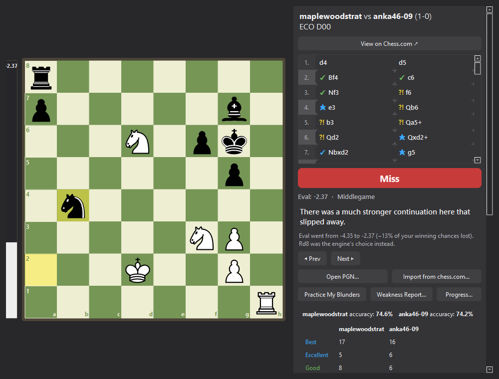
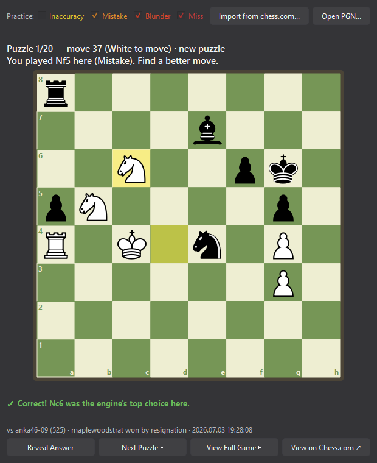
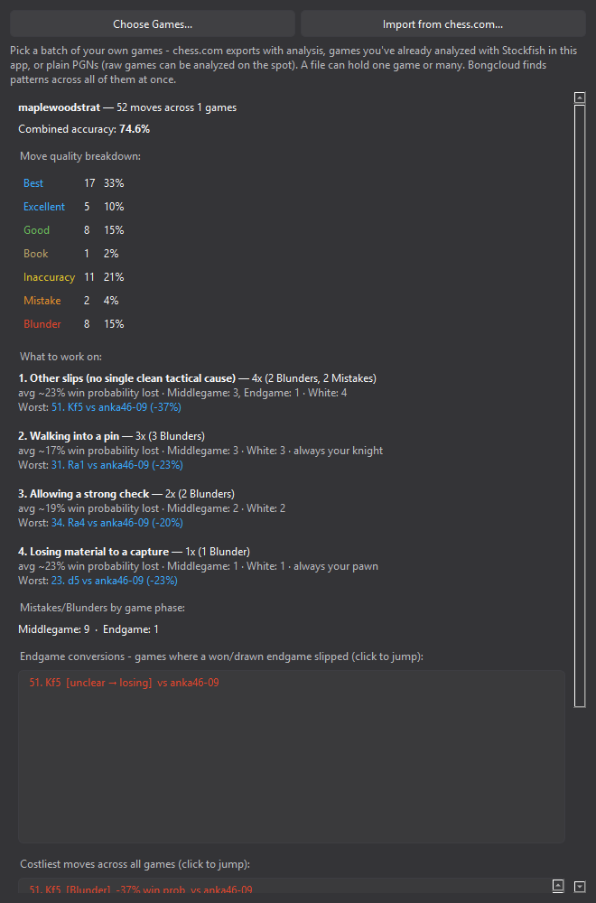
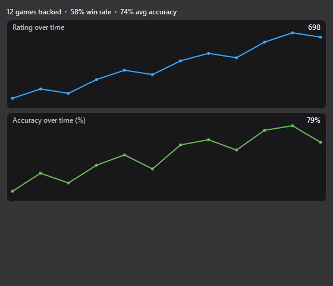
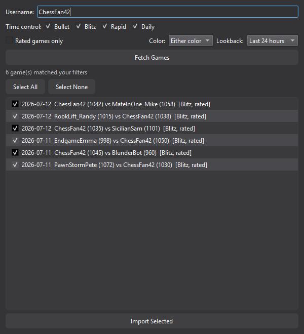

# Bongcloud

A native Windows desktop app for reviewing your own chess games — built as a
supplement to chess.com, not a replacement for it. Where chess.com tells you
*that* a move was a Blunder, Bongcloud tries to tell you *why*, and then gives
you tools to actually fix the pattern instead of just reading about it.

Runs as a single `.exe` with no Python install required (see
[Packaging](#packaging) below), or straight from source with PySide6.

## Features

### Game review with tactical "why" explanations

Open any PGN — a chess.com export with `[%eval]` annotations already baked
in, or a plain game with no analysis at all (Bongcloud runs Stockfish over it
automatically, no prompt needed). Step through the game move by move and see,
for every mistake, not just a classification but a concrete explanation of
what the opponent's best reply actually exploits — a hanging piece, a fork, a
pin, a skewer, a discovered attack, a check — instead of a vague "the
position swings sharply here."

Classifications go beyond the usual Best/Excellent/Good/Inaccuracy/Mistake/
Blunder: **Brilliant** for a real, non-obvious material sacrifice that's
still objectively strong, **Great** for a critical "only good move" (only
available for games Bongcloud analyzes itself, since chess.com's own
annotations don't carry the data needed to detect it), **Book** for known
opening theory, and a broadened **Miss** that covers not just missed forced
mates but any real chunk of a winning position given back. Game/session
accuracy uses the same volatility-weighted approach chess.com's own Game
Review does (not a naive average), so a handful of real blunders actually
show up in the number instead of getting diluted across every quiet move
around them.

The board automatically flips to put you on the bottom when you played
Black, plays a distinct sound for moves/captures/checks, and — if the game
came from chess.com — shows a link straight to it there. A chess.com-style
eval bar sits to the left of the board, always in sync with the position on
screen. The same window also surfaces a full game summary inline: combined
accuracy, a move-quality breakdown table for both players, a filled
win-probability eval chart (with an arrow marking exactly where you are in
the game as you step through it) you can click to jump to any point, and a
"Costliest moments" list of your biggest evaluation swings. Step through the
game with the on-screen buttons or the arrow keys.



### Practice My Blunders (puzzle trainer)

Every Mistake, Blunder, and Miss in the loaded game becomes an interactive
puzzle, served in random order rather than move-by-move so multi-game
sessions don't just replay one game after another: you're shown the position
right before you went wrong and challenged to find the engine's move
yourself, instead of just being told what you should have played. Click a
piece to see its legal destinations highlighted, then click a square to
attempt the move — the board orients to match whichever side is to move in
that puzzle. Guess wrong and, if a local Stockfish engine is available,
Bongcloud tells you where your guess actually ranked ("the engine's 3rd
choice" vs. "not in the top 5") instead of a flat "try again." "Reveal
Answer" shows the correct move plus the same tactical explanation used in
the main review. Checkboxes let you practice specific move types only.

Solving or revealing a puzzle also surfaces the game it came from — who you
played, who won, and when — with a button to jump straight to that position
in the main review window to step through the whole game, plus a direct link
to the game on chess.com when it came from there.

Unlike a generic tactics trainer, every puzzle here is a mistake you actually
made, so solving it is directly tied to a game you played. Puzzles you get
wrong or reveal resurface sooner; ones you solve cleanly get spaced out
further, so repeat sessions focus on what you're still missing instead of
replaying everything in the same order every time.



### Weakness Report (cross-game pattern tracking)

Pick a batch of your own games at once — annotated or raw (raw games can be
analyzed with a local Stockfish engine on the spot), one game per file or
several — and Bongcloud aggregates your Mistakes, Blunders, and Misses across
all of them into one report: combined accuracy, a move-quality breakdown, and
a ranked "What to work on" list, broken down by tactical motif (walking into
pins or skewers, missing checks or discovered attacks, losing material to
captures, ...). Every motif is shown, not just the top few, each with a
severity split, which game phase and color it skews toward, which piece is
usually the one you lose or get pinned where that's knowable, and a link to
your single worst example of it that jumps straight to that position on the
board. A dedicated "Endgame conversions" section separately flags games where
a won or drawn endgame slipped away — a distinct, common leak from tactical
blunders. It also lists your costliest moves across every game selected, and
breaks down Mistakes/Blunders by phase overall.

Raw batches larger than a few games prompt before spending time on Stockfish
analysis, with a "faster analysis" option (checked by default) that trades
some accuracy for speed; small batches (like a single freshly-imported game)
just analyze without asking, since stopping to confirm every time is pure
friction. If it can't tell which side you played from the game headers
alone, it asks once and remembers your answer for next time — games imported
from chess.com skip that question entirely, since the account is already
known.



### Progress dashboard

Every game you view, import, or analyze gets logged automatically (deduped,
so revisiting the same game never double-counts) - the Progress dashboard
charts your chess.com rating and accuracy over time across everything
tracked so far, so you can actually see whether the practice is working
instead of just hoping it is.



### Import from chess.com

Pull games straight from a chess.com account instead of exporting PGNs by
hand — available from the main window, Weakness Report, and the puzzle
trainer. Filter by time control (e.g. Rapid only), rated-only, color played,
and how far back to look — from the last 24 hours or the last week for quick
post-session review, up through whole months or all time — preview the
matches (always shown most-recent-first), and pick which ones to keep;
shift-click a game to select every game between it and your last click in
one go. Imports are capped at 300 games per fetch, so a single import can't
accidentally pull in someone's entire multi-year history.



## Files

| File | Purpose |
|---|---|
| `review_app.py` | Main window: board, move list, commentary, summary panel |
| `board_widget.py` | Shared chessboard rendering + click-to-move input |
| `scoresheet.py` | Commentary generation and tactical "refutation" analysis |
| `opening_book.py` | Small built-in opening-theory table for the Book classification |
| `pgn_loader.py` | Parses chess.com-style annotated PGNs into `MoveRecord`s |
| `engine_analysis.py` | Runs Stockfish over un-annotated PGNs |
| `summary_dialog.py` | Game summary panel (accuracy, breakdown, eval chart) |
| `sound.py` | Move/capture/check sound effects |
| `puzzle_trainer.py` | Practice My Blunders |
| `puzzle_history.py` | Spaced-repetition schedule for puzzles (persisted between sessions) |
| `weakness_report.py` | Cross-game weakness aggregation |
| `game_history.py` | Cross-session log of every game viewed, for the Progress dashboard |
| `progress_dialog.py` | Rating/accuracy-over-time dashboard |
| `player_identity.py` | Remembers which player name is "you" across sessions |
| `chesscom_import.py` | chess.com API fetch/filter logic |
| `chesscom_import_dialog.py` | Import from chess.com UI |

## Running from source

```
pip install PySide6 python-chess requests
python review_app.py
```

Or use `run_app.bat`, which does the same thing from the repo root.

A Stockfish executable is only needed for analyzing games that don't already
carry `[%eval]` annotations — set `STOCKFISH_PATH`, have `stockfish` on your
`PATH`, or the app will prompt you to browse to it.

## Packaging

Bundled with PyInstaller as a single-file, windowed executable
(`Bongcloud.spec`):

```
pyinstaller Bongcloud.spec
```

Or use `build_exe.bat` from the repo root, which does the same thing.

Produces `dist/Bongcloud.exe` — no Python installation needed to run it. The
build automatically copies a `stockfish.exe` found via `STOCKFISH_PATH` or
`PATH` into `dist/` alongside it; if none is found, the packaged app will
prompt you to browse to one at runtime instead.
